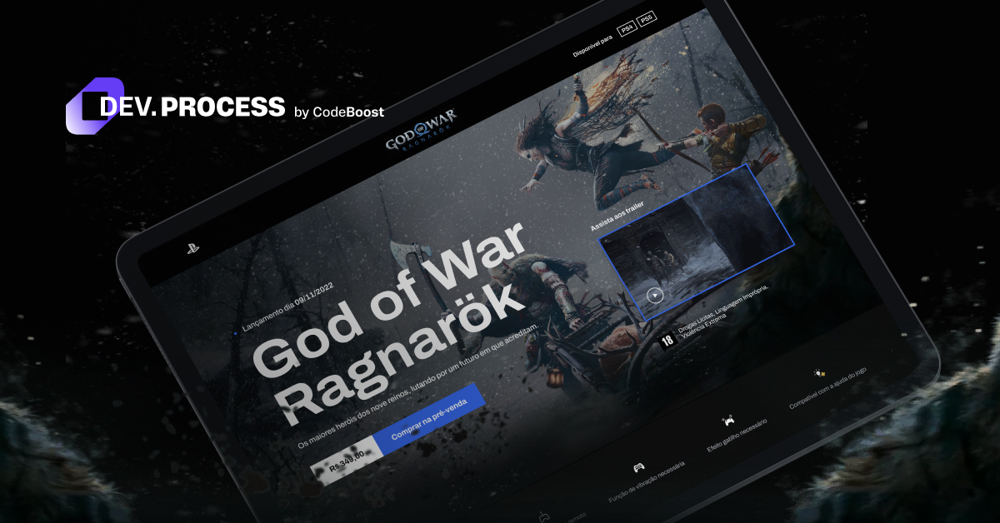

<h1 align="center"> God of War: Ragnarök </h1>

DevProcess é um evento on-line e gratuito, promovido pelo CodeBoost e aconteceu entre os dias 21 e 24 de novembro de 2022.  

  <a href="#-tecnologias">Tecnologias</a>&nbsp;&nbsp;&nbsp;|&nbsp;&nbsp;&nbsp;
  <a href="#-projeto">Projeto</a>&nbsp;&nbsp;&nbsp;|&nbsp;&nbsp;&nbsp;
  <a href="#-layout">Layout</a>&nbsp;&nbsp;&nbsp;

 

  

## 🚀 Tecnologias

Esse projeto foi desenvolvido com as seguintes tecnologias:

- HTML, CSS e SCSS
- JavaScript
- Git e Github
- Figma

## 💻 Projeto

O projeto foi desenvolvido com o objetivo de aperfeiçoar os conhecimentos nas tecnologias utilizadas para a criação de uma landing page baseada no jogo God of War: Ragnarök

- [Visite o projeto online](https://charlesalmeiida.github.io/god-of-war/)

## 🔖 Layout

Você pode visualizar o layout do projeto através [DESSE LINK](https://www.figma.com/file/YqA1m3fXyTinVPVhCbHbwi/Codeboost---God-of-War-Ragnarok-(Copy)?node-id=0%3A1&t=5ng1CJtJ04LXeMiF-1). É necessário ter conta no [Figma](https://figma.com) para acessá-lo.

